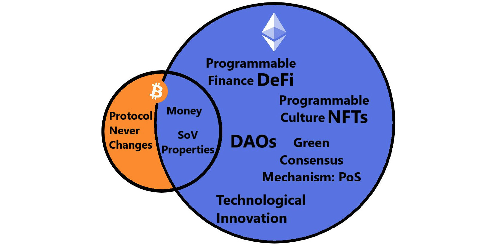

# Vítejte na Gwei.cz

**Gwei.cz je Česko/Slovenská komunita příznivců platformy **[**Ethereum**](klicove-pojmy.md#ethereum)** a hnutí okolo **[**decentralizovaných financí**](klicove-pojmy.md#decentralizovane-finance-defi)** (DeFi). Nezajímá nás spekulace na ceně, ale reálný technologický pokrok v otevřených a decentralizovaných službách, které v rámci DeFi mění svět tradičních financí. Fintech je minulost – DeFi budoucnost.**

### :handshake: Přidejte se k nám

Ke komunitě se může přidat každý, a to hned na několika [platformách](komunikacni-kanaly/):

* Na [Fóru](https://forum.gwei.cz), kde řešíme spíše komunitní věci (projekty, akce, atd.)
* Na nášem [Discord](https://chat.gwei.cz) chatu, kde se bavíme o novinkách či pomáháme nováčkům a probíhají zde i také pravidelné setkání v místnosti [#etheroom](udalosti/etheroom/)
* Můžete nás sledovat i na [Twitteru](https://twitter.com/gweicz), kde informujeme o novinkách

Můžete nám také [**pomoci s rozvojem komunitních projektů**](podporte-nas/), na kterých společně pracujeme a pomáháme tak celému Ethereum ekosystému.

Každá komunita musí být alespoň v omezené míře spravována. U nás k tomu slouží [Council](council/).

### :notepad_spiral:Naše hodnoty

* Otevřenost
* Decentralizace
* Neutralita
* Odolnost vůči cenzuře
* Veřejný zájem
* Transparentnost

### :tada: Naše cíle

* Šíření osvěty o Ethereu, DeFi a dalších otevřených kryptoměnách
* Tvorba projektů nebo alespoň podpora nově vznikajících projektů
* Tvorba komunikačního a informačního prostoru pro všechny příznivce stejných hodnot


"Gwei" znamená "giga-wei", tedy milion "wei". "Wei" je [nejmenší monetární jednotka Etheru (ETH)](https://ethdocs.org/en/latest/ether.html). Je pojmenovaná po čínském kryptografovi [Wei Dai](https://en.wikipedia.org/wiki/Wei_Dai), který přispěl zásadní měrou ke vzniku kryptoměn.

