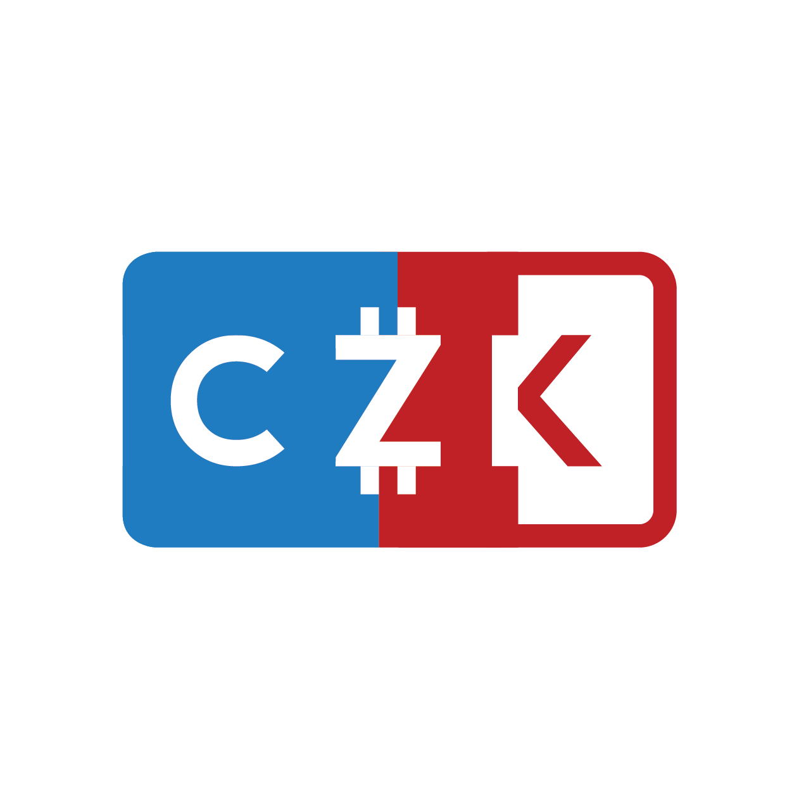

# dCZK stablecoin


Projekt pozastaven a dnes již neaktuální


> **dCZk** je decentralizovaný ERC-20 kompatibilní stablecoin, navázaný na kurz CZK a krytý na 100% rezervou v DAI (decentralizovaný stablecoin navázaný na americký dolar). Součástí dCZK je automatické pozitivní úročení všech účtů (_spoření_) a vlastní decentralizovaná směnárna (DEX), která zaručuje že je vždy možné vyměnit DAI za dCZK a naopak.

Autor: [@tree](https://forum.gwei.cz/u/tree)

Projekt byl aktivní v období **únor - březen 2020**



