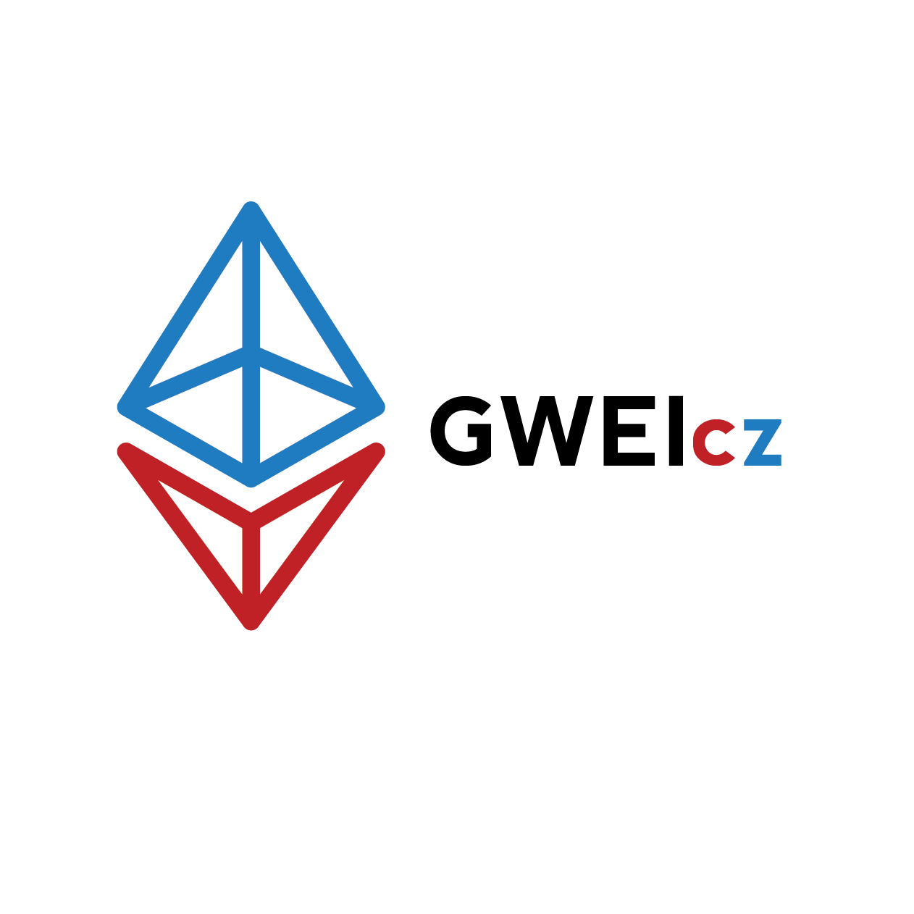

# Media Kit

Všechny soubory naleznete také na našem GitHub repozitáři **brand:**



## Logo

### Logo bez textu

* transparentní - [https://raw.githubusercontent.com/gweicz/brand/master/logo/gwei3.png](https://raw.githubusercontent.com/gweicz/brand/master/logo/gwei3.png)
* bílé pozadí - [https://raw.githubusercontent.com/gweicz/brand/master/logo/gwei3-white-bg.png](https://raw.githubusercontent.com/gweicz/brand/master/logo/gwei3-white-bg.png)

### **Logo s textem pod**

* transparentní -  [https://raw.githubusercontent.com/gweicz/brand/master/logo/gwei1.png](https://raw.githubusercontent.com/gweicz/brand/master/logo/gwei1.png)
* bílé pozadí - [https://raw.githubusercontent.com/gweicz/brand/master/logo/gwei1-white-bg.png](https://raw.githubusercontent.com/gweicz/brand/master/logo/gwei1-white-bg.png)

### Logo s textem napravo

* transparentní - [https://raw.githubusercontent.com/gweicz/brand/master/logo/gwei2.png](https://raw.githubusercontent.com/gweicz/brand/master/logo/gwei2.png) 

### Logo pro Trezor homescreen

* [https://raw.githubusercontent.com/gweicz/brand/master/logo/gwei-trezor-homescreen.png](https://raw.githubusercontent.com/gweicz/brand/master/logo/gwei-trezor-homescreen.png)

