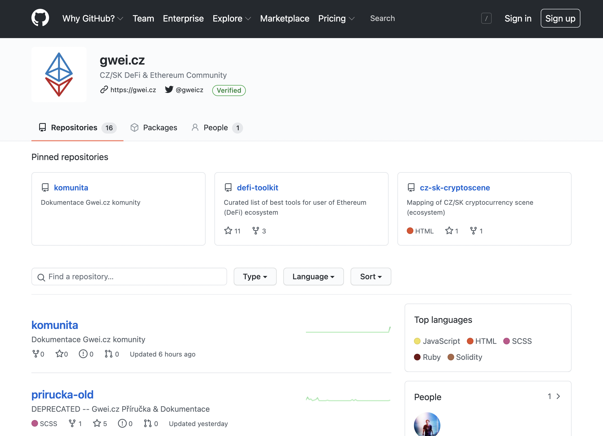

# GitHub



* Organizace: [**github.com/gweicz**](https://github.com/gweicz)****
* Spravuje: [Council](../council/)
* Administrátoři: [@tree](https://forum.gwei.cz/u/tree), [@rixcian](https://forum.gwei.cz/u/rixcian), [@kleinpetr](https://forum.gwei.cz/u/kleinpetr), [@coinmandeer](https://forum.gwei.cz/u/coinmandeer)

Repozitáře našich projektů a jejich zdrojových kódů. Kdokoliv, kdo má [GitHub účet](https://github.com/join) může vytvořit nový podnět (issue) nebo navrhnout změny (PR). Najdete tam například i [tuto dokumentaci](https://github.com/gweicz/komunita).

## Naše repozitáře

* [web](https://github.com/gweicz/web) - Zdrojové kódy naší landing-page na gwei.cz
* [komunita](https://github.com/gweicz/komunita) - Tato komunitní dokumentace (viz. [GitBook](gitbook.md))
* [defi-toolkit](https://github.com/gweicz/defi-toolkit) - Projekt [DeFi Toolkit](../dokumentace/defi-toolkit.md) (záloha dokumentu na [HackMD](hackmd.md))
* [brand](https://github.com/gweicz/brand) - Naše loga a další vizuální materiály

## Náhled

