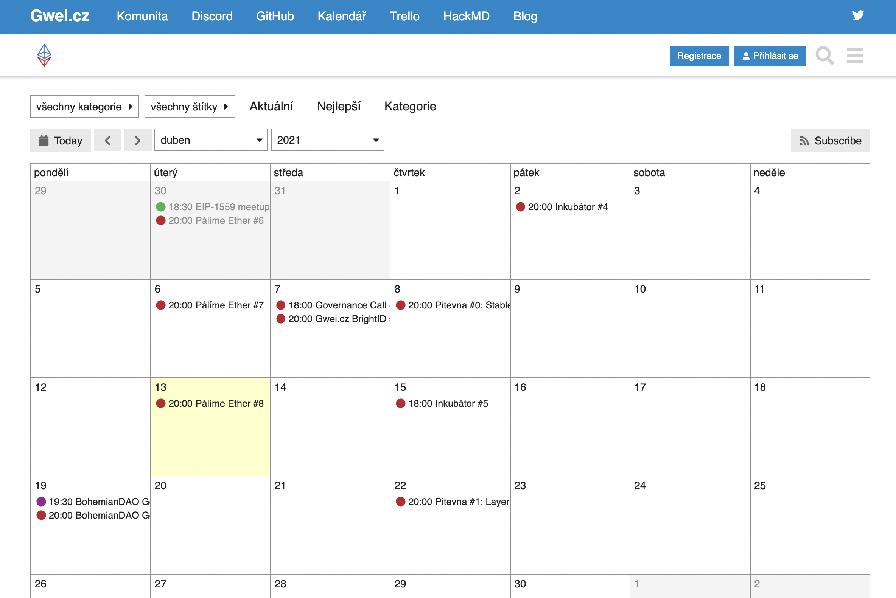

# Kalendář

* Adresa: [forum.gwei.cz/calendar](https://forum.gwei.cz/calendar)

Na našem [fóru](../komunikacni-kanaly/forum.md) máme Kalendář, kde najdete všechny naše události, například [Governance Call](../council/governance-call/), nebo další události v [#etheroom](../udalosti/etheroom/).

Události se tvoří připojením k nějakému diskuznímu tématu, je to tedy přímo napojené na [Fórum](../komunikacni-kanaly/forum.md).

## Jak kalendář odebírat?

Dostupné jsou následující možnosti:

* iCal: [webcal://forum.gwei.cz/calendar.ics](webcal://forum.gwei.cz/calendar.ics)
* RSS: [https://forum.gwei.cz/calendar.rss](https://forum.gwei.cz/calendar.rss)

Tyto odkazy naleznete pokud v Kalendáři kliknete na tlačítko "_Subscribe_".

## Náhled

