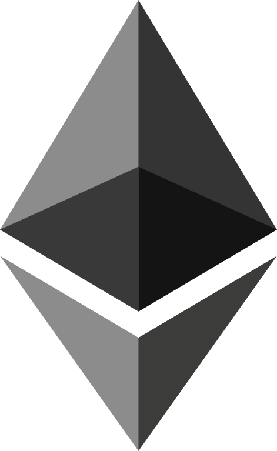

# Finanční podpora

Jsme nezisková komunita – vše děláme bez vidiny zisku, protože si myslíme že šíření povědomí o DeFi a ETH je potřeba. Kvuli nám samotným, kvůli našim dětem - a budoucnosti bez bank a bailoutů.

A víte co je na tom nejlepší? Že i vy toho můžete být součástí!

Pokud se vám naše práce líbí či vám příjde přínosná - budeme velice rádi pokud nás finančně podpoříte a umožníte nám dělat, to co děláme, ještě lépe. Sami toho moc nedokážeme a jen s vaší pomocí můžeme něco opravdu změnit.

## Na co peníze využijeme?

* platby za služby spojené s provozem komunity (doména, VPS, atp.)
* tvorba edukačních materiálů o ETH/DeFi
* organizace komunitních meetupů a hackatonů
* podpora zajímavých komunitních projektů

## Adresa pro finanční dary

### Ethereum 

**Ether (ETH)** či jakkýkoliv **ERC-20** token posílejte na tuto adresu:

`0x6c171579f8F3c3F65B30286b14C20a46a4eb55b9` - [gweicz.eth](https://etherscan.io/address/0x6c171579f8f3c3f65b30286b14c20a46a4eb55b9)

__


Tato adresa je platná jen pro Ethereum mainnet, ne pro Polygon nebo další sítě - na těch máme jiné adresy, viz. níže.


Naše adresy na další síťě - na xDai , Polygonu  nebo Arbitrum  naleznete na stránce [Council -> Pokladna](../council/pokladna.md#prehled-uctu).

## Kdo může s dary nakládat?

Prostředky jsou ve správě našeho councilu v [Pokladně](../council/pokladna.md).&#x20;
